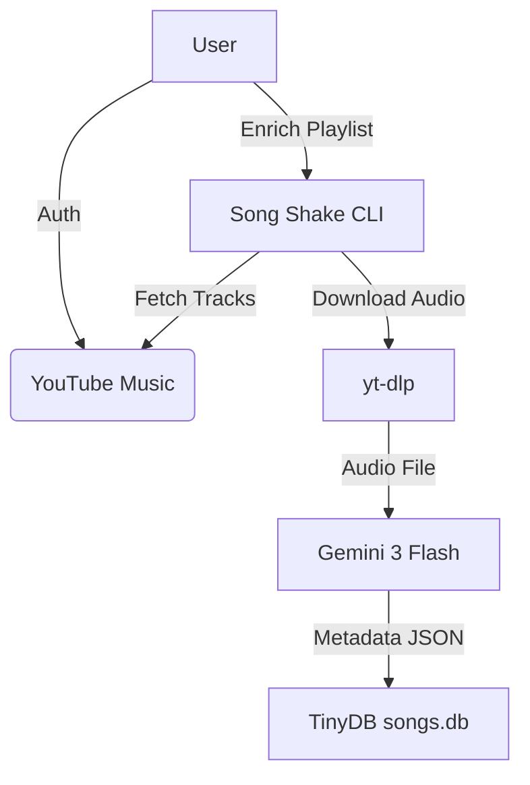

# Song Shake (v0.5.0)

Is your playlist feeling a bit stale? Does it lack that *metadata spice*? **Song Shake** is here to fix that!

This tool takes your YouTube Music playlists and enriches them with **Genres** and **Moods** using the power of **Google Gemini 3 Flash**.

## Features

-   **Web Interface (New!)**: Modern UI for managing enrinchment (Login, Dashboard, Progress, Results).
-   **CLI Tool**: Classic command-line interface for quick operations.
-   **Smart Enrichment**: Uses AI to analyze audio and determine genre/mood.
-   **Local Database**: Stores results in `songs.db` (TinyDB).
-   **Seamless Auth**: Securely authenticate with your YouTube Music account.
-   **Audio Download**: Automatically downloads tracks using `yt-dlp`.
-   **AI Enrichment**: Uses **Gemini 3 Flash Preview** to listen to audio and extract:
    -   Genres (e.g., Pop, Indie, Rock)
    -   Moods (e.g., Energetic, Melancholic, Chill)
-   **Persistent Storage**: Saves enriched data to a local `songs.db` (TinyDB).
-   **Cost Tracking**: Tracks Gemini API token usage and estimated cost.

## Workflow



## Prerequisites

1.  **Python 3.11+**
2.  **uv** (Modern Python package manager)
    -   Install: `curl -LsSf https://astral.sh/uv/install.sh | sh`
    -   Or via Brew: `brew install uv`
3.  **ffmpeg** (Required for audio processing)
    -   Install: `brew install ffmpeg`

## Installation

You can install Song Shake globally using `uv tool`:

```bash
# Install directly from source/directory
uv tool install . --force

# Or if it were on PyPI (not yet)
# uv tool install song-shake
```

To update later:
```bash
uv tool upgrade song-shake
```

## Usage

### 1. Authentication

First, setup your YouTube Music headers (required to access your playlists).

```bash
song-shake setup-auth
```

*   Go to `music.youtube.com`
*   Open DevTools (F12) > Network
*   Filter for `browse`
*   Refresh page
*   Right-click a request > Copy > Copy Request Headers
*   Paste into the terminal

### 2. List Playlists

Find the playlist you want to process.

```bash
song-shake list-playlists
```

Copy the **ID** of your desired playlist.

### 3. Enrich Playlist

Process the playlist. This will download tracks, send to Gemini, and save results.

```bash
song-shake enrich <PLAYLIST_ID>
```

**Options:**
-   `--wipe` / `-w`: Wipe the database before starting (fresh start).

Example:
```bash
song-shake enrich PL12345... --wipe
```

### 4. Show Enriched Songs

View the tracks currently stored in your local database.

```bash
song-shake show [OPTIONS]
```

**Options:**
-   `--limit` / `-l`: Number of rows to show (default: 100).
-   `--genre` / `-g`: Filter by genre (case-insensitive).
-   `--mood` / `-m`: Filter by mood (case-insensitive).

Example:
```bash
song-shake show --genre "Pop" --limit 50
```

## Configuration

The tool uses `.env` file for credentials.
-   `GOOGLE_API_KEY`: Your Gemini API Key.

If `.env` is missing, you will be prompted to enter it.

## Quirks & Notes

-   **Gemini 3 Flash Preview**: This model is in preview. Pricing is approx $1.00/1M input audio tokens.
-   **Audio Only**: The tool strictly downloads audio to save bandwidth and tokens.
-   **Cookies**: Authentication relies on browser cookies which may expire. If auth fails, just run `setup-auth` again.

## License

MIT
