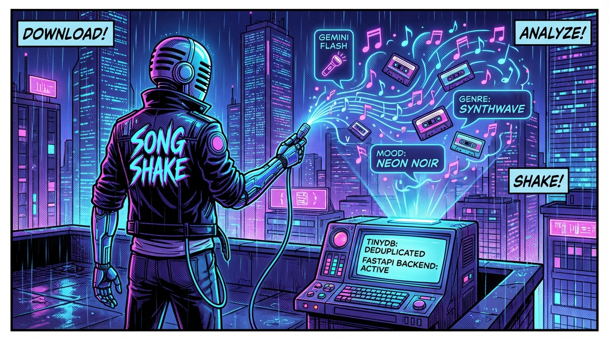
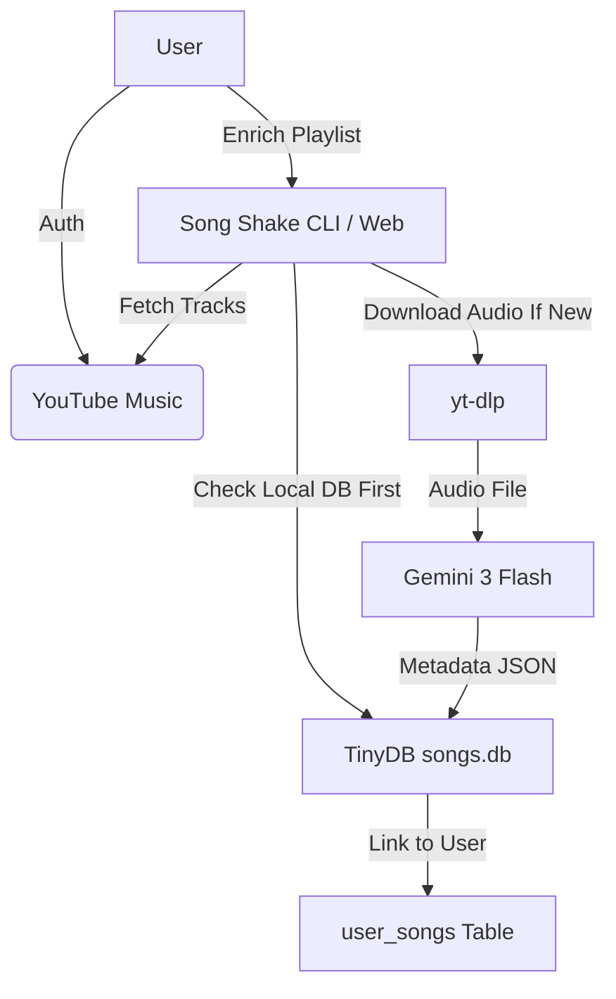
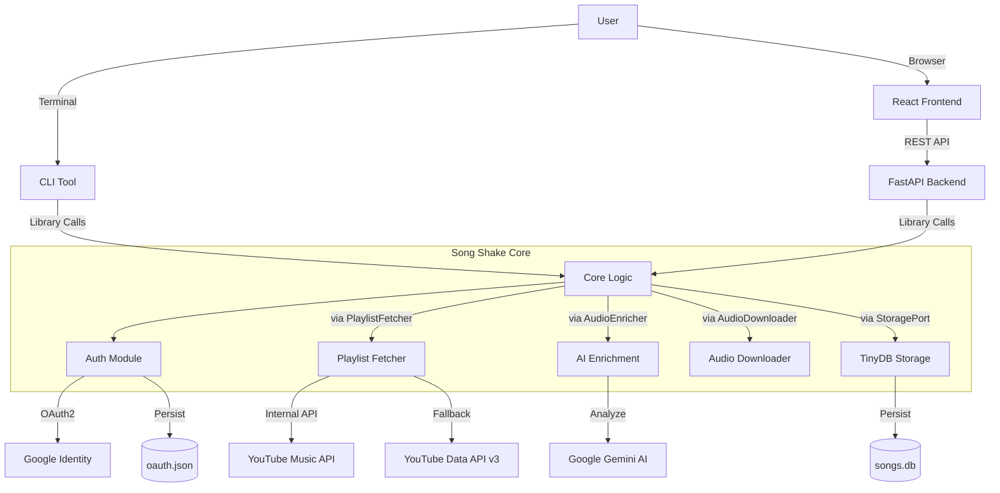

# Song Shake (v0.8.0)

Is your playlist feeling a bit stale? Does it lack that *metadata spice*? **Song Shake** is here to fix that!

This tool takes your YouTube Music playlists and enriches them with **Genres**, **Moods**, **Instruments**, **BPM**, and **Play Count** using the power of **Google Gemini 3 Flash** and **YouTube Music API**.

## Features

-   **Web Interface (New!)**: Modern UI for managing enrinchment (Login, Dashboard, Progress, Results).
-   **Background Job Support**: Identify running enrichment tasks on the dashboard and resume viewing real-time progress without double-processing.
-   **Concurrent Job Safety**: Thread-safe database access, atomic job creation, and isolated temp directories prevent race conditions when running multiple enrichment jobs simultaneously.
-   **Real-Time AI Usage Tracking**: Live token count and cost updates via SSE with animated footer display.
-   **Zombie Job Recovery**: Jobs orphaned by server restart are automatically detected and cleanly cancelled.
-   **CLI Tool**: Classic command-line interface for quick operations.
-   **Rich Song Metadata**: Fetches detailed per-song data including multiple artists with individual channel links, album with browse links, release year, and play count (e.g. 3.5M, 123K).
-   **Smart Enrichment**: Uses AI to analyze audio and determine genre/mood. Core logic is fully testable via Protocol-based dependency injection.
-   **Local Database**: Stores results in `songs.db` (TinyDB).
-   **Seamless Auth**: Securely authenticate with your YouTube Music account.
-   **Audio Download**: Automatically downloads tracks using `yt-dlp`.
-   **AI Enrichment**: Uses **Gemini 3 Flash Preview** to listen to audio and extract:
    -   Genres (e.g., Pop, Indie, Rock)
    -   Moods (e.g., Energetic, Melancholic, Chill)
    -   Instruments (e.g., Guitar, Piano, Drums)
    -   BPM (Beats Per Minute)
-   **Persistent Storage**: Saves enriched data to a local `songs.db` (TinyDB) with a dual-table deduplication architecture:
    -   `songs`: A global catalog storing processed tracks to avoid redundant LLM analysis across users.
    -   `user_songs`: A relational table linking individual users to specific tracks in the global catalog.
-   **Resilient Processing**: Tracks that fail to enrich are still saved and visually flagged, ensuring complete playlist visibility.
-   **Cost Tracking**: Tracks Gemini API token usage and estimated cost in real-time during enrichment.
-   **Smart Filtering**: Filter by specific Genres, Moods, Instruments, or Enrichment Status directly on the Results page. Filter by BPM range as well.

## Workflow



## Prerequisites

1.  **Python 3.11+**
2.  **uv** (Modern Python package manager)
    -   Install: `curl -LsSf https://astral.sh/uv/install.sh | sh`
    -   Or via Brew: `brew install uv`
3.  **ffmpeg** (Required for audio processing)
    -   Install: `brew install ffmpeg`

## Installation

You can install Song Shake globally using `uv tool`:

```bash
# Install directly from source/directory
uv tool install . --force

# Or if it were on PyPI (not yet)
# uv tool install song-shake
```

To update later:
```bash
uv tool upgrade song-shake
```

## Usage

### 1. Authentication

First, setup your YouTube Music headers (required to access your playlists).

```bash
song-shake setup-auth
```

*   Go to `music.youtube.com`
*   Open DevTools (F12) > Network
*   Filter for `browse`
*   Refresh page
*   Right-click a request > Copy > Copy Request Headers
*   Paste into the terminal

### 1a. (Alternative) Web Interface Login
For a smoother experience with the Web UI:
1.  Create a **Web Application** credential in Google Cloud Console.
2.  Set **Authorized Redirect URI** to `http://localhost:8000/auth/google/callback`.
3.  Add `GOOGLE_CLIENT_ID` and `GOOGLE_CLIENT_SECRET` to your `.env` file.
4.  Click **"Login with Google"** on the dashboard.

### 2. List Playlists

Find the playlist you want to process.

```bash
song-shake list-playlists
```

Copy the **ID** of your desired playlist.

### 3. Enrich Playlist

Process the playlist. This will download tracks, send to Gemini, and save results.

```bash
song-shake enrich <PLAYLIST_ID>
```

**Options:**
-   `--wipe` / `-w`: Wipe the database before starting (fresh start).

Example:
```bash
song-shake enrich PL12345... --wipe
```

### 4. Show Enriched Songs

View the tracks currently stored in your local database.

```bash
song-shake show [OPTIONS]
```

**Options:**
-   `--limit` / `-l`: Number of rows to show (default: 100).
-   `--genre` / `-g`: Filter by genre (case-insensitive).
-   `--mood` / `-m`: Filter by mood (case-insensitive).

Example:
```bash
song-shake show --genre "Pop" --limit 50
```

## 🏗 Architecture



## 🧩 Components

### 1. Command Line Interface (CLI)
The original power-user tool.
- **Usage**: `song-shake [COMMAND]`
- **Features**: Auth management, playlist processing, searching, and exporting.
- **Best for**: Headless servers,cron jobs, or quick terminal checks.

### 2. Backend API
A FastAPI-based server that exposes the core logic to the web.
- **Port**: 8000
- **Docs**: `http://localhost:8000/docs`
- **Key Features**: 
    - Real-time SSE stream for enrichment logs.
    - Robust OAuth flow (Web Application).
    - Intelligent fallback to YouTube Data API for channel-less accounts.

### 3. Frontend (Web UI)
A modern, responsive React application.
- **Port**: 5173 (Vite)
- **Features**:
    - "Login with Google" integration with graceful session expiration handling.
    - Dashboard with playlist selection, processing history, and relative time badges.
    - Real-time progress visualization with live API token and cost tracking.
    - Rich, interactive results view with playback and advanced tag/status filtering.

## ⚠️ Gotchas & Pitfalls

### 1. The "No Channel" Issue
**Problem**: The internal YouTube Music API (used by `ytmusicapi`) fails if the Google Account doesn't have a YouTube Channel created, returning `400 Bad Request`.
**Solution**: Song Shake implements a **smart fallback**. If the internal API fails, it automatically switches to the public **YouTube Data API v3** using the same credentials. This allows users without a channel (e.g., pure GSuite or standard Gmail users) to still fetch their playlists and tracks perfectly.

### 2. Authentication Flow
- **CLI**: Uses Browser Header Paste (copy request headers from DevTools and paste into the terminal).
- **Web**: Uses Web Application Flow (standard "Login with Google" redirect).
- **Token Compatibility**: Both flows generate an `oauth.json` file. The backend is designed to handle both, but for the best Web UI experience, use the Web Login button.

### 4. Database Deduplication (New in v0.5)
**Problem**: Processing the same song for multiple users wastes LLM tokens and time.
**Solution**: Song Shake now utilizes a dual-table architecture in TinyDB. Before downloading or sending a track to Gemini, it queries the `songs` catalog. If the `videoId` already exists globally, it skips the LLM and instantly links the track to the user's `user_songs` record, resulting in a **0-token cost** hit!
- **YouTube Data API**: Has a quota (default 10,000 units/day). Listing playlists is cheap (1 unit), but heavy usage might hit limits.
- **Gemini**: The Flash model is fast and cheap, but ensure your `GOOGLE_API_KEY` has billing enabled for sustained high-volume usage.

## 🚀 Development

### Backend
```bash
uv run uvicorn song_shake.api:app --reload --port 8000
```

### Frontend
```bash
cd web
npm run dev
```

### CLI
```bash
song-shake --help
```

## Configuration

The tool uses `.env` file for credentials (see `.env.template`):
-   `GOOGLE_API_KEY`: Your Gemini API Key (required for enrichment).
-   `GOOGLE_CLIENT_ID`: Google OAuth Web Application Client ID (optional, for Web UI login).
-   `GOOGLE_CLIENT_SECRET`: Google OAuth Web Application Client Secret (optional, for Web UI login).

If `GOOGLE_API_KEY` is missing, the CLI will prompt you to enter it.

## Quirks & Notes

-   **Gemini 3 Flash Preview**: This model is in preview. Pricing is approx $1.00/1M input audio tokens.
-   **Audio Only**: The tool strictly downloads audio to save bandwidth and tokens.
-   **Cookies**: Authentication relies on browser cookies which may expire. If auth fails, just run `setup-auth` again.

## License

MIT
