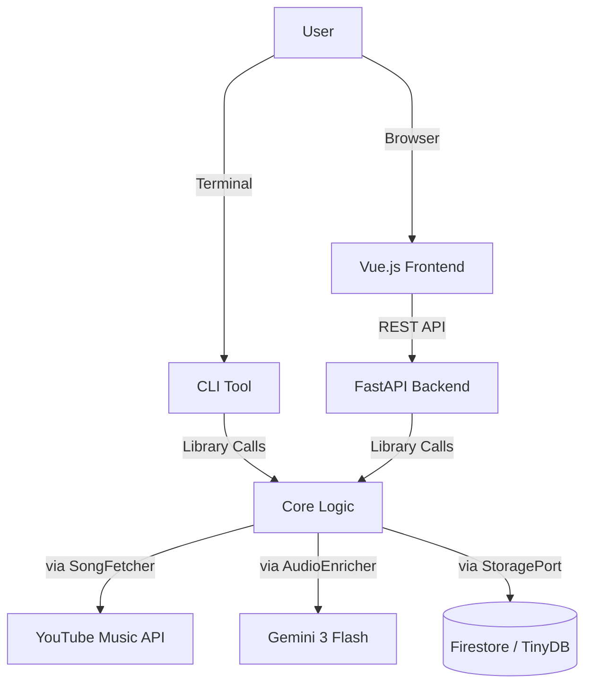

# Song Shake (v0.11.0)

Is your playlist feeling a bit stale? Does it lack that *metadata spice*? **Song Shake** enriches your YouTube Music playlists with **Genres**, **Moods**, **Instruments**, **BPM**, and **Play Counts** using **Google Gemini 3 Flash** and **YouTube Music API**.

## ✨ Features

- **Web Interface**: Modern Vue.js UI with Google OAuth login, real-time enrichment progress, and interactive results.
- **URL-Based AI Enrichment**: Gemini analyzes tracks via YouTube URL — no audio download needed.
- **Rich Metadata**: Artists with channel links, album with browse links, release year, play count, BPM, and vocal type.
- **Smart Deduplication**: Global song catalog avoids redundant AI calls — 0-token cost for previously analyzed tracks.
- **Retry Failed Tracks**: Per-track retry with UNPLAYABLE fallback (finds playable alternative via search).
- **Background Jobs**: Concurrent-safe enrichment with real-time progress via polling.
- **Firestore Storage** (production) / TinyDB (local development).
- **CLI Tool**: Classic command-line interface for quick operations.

## 🏗 Architecture

See [docs/ARCHITECTURE.md](docs/ARCHITECTURE.md) for development vs production diagrams and component descriptions.



## 🚀 Quick Start

### Prerequisites

1. **Python 3.11+** with **uv** (`brew install uv` or `curl -LsSf https://astral.sh/uv/install.sh | sh`)
2. **Node.js 18+** (for frontend)

### Development

```bash
# Backend
cp .env.template .env   # Fill in your API keys
uv sync
uv run uvicorn song_shake.api:app --reload --port 8000

# Frontend (separate terminal)
cd web && npm install && npm run dev
```

Open http://localhost:5173 and login with Google.

### Configuration (`.env`)

| Variable             | Required | Description                           |
|----------------------|----------|---------------------------------------|
| `GOOGLE_API_KEY`     | Yes      | Gemini API key for AI enrichment      |
| `GOOGLE_CLIENT_ID`   | Yes      | Google OAuth Web Client ID            |
| `GOOGLE_CLIENT_SECRET` | Yes    | Google OAuth Web Client Secret        |
| `JWT_SECRET`         | Prod     | JWT signing secret (auto-generated in dev) |
| `STORAGE_BACKEND`    | No       | `firestore` or `tinydb` (default: tinydb) |

## 🚢 Deployment

See [docs/DEPLOYMENT.md](docs/DEPLOYMENT.md) for production deployment to Cloud Run + Firebase Hosting.

```bash
# Quick deploy (backend + frontend)
./deploy.sh

# Backend only
./deploy.sh --backend-only

# Frontend only
./deploy.sh --frontend-only
```

## ⚠️ Gotchas

### The "No Channel" Issue
The internal YouTube Music API fails if the Google Account lacks a YouTube Channel. Song Shake implements a **smart fallback** to the public YouTube Data API v3 using the same credentials.

### Session Management
- **Web**: JWT sessions (24h) with automatic Google token refresh.
- **CLI**: Browser header paste authentication.

### Cost Awareness
- **Gemini**: ~$0.10/1M input tokens, ~$0.40/1M output tokens (Flash). A 100-song playlist typically costs $0.01–$0.05.
- **YouTube Data API**: 10,000 units/day quota (listing playlists = 1 unit).

## License

MIT
