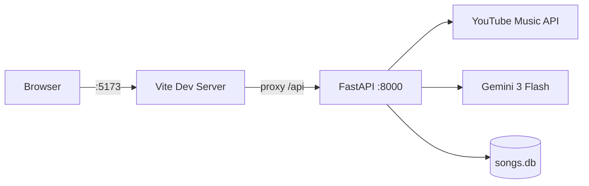
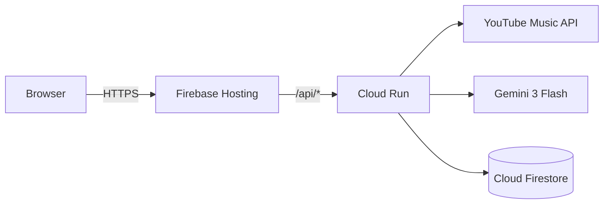
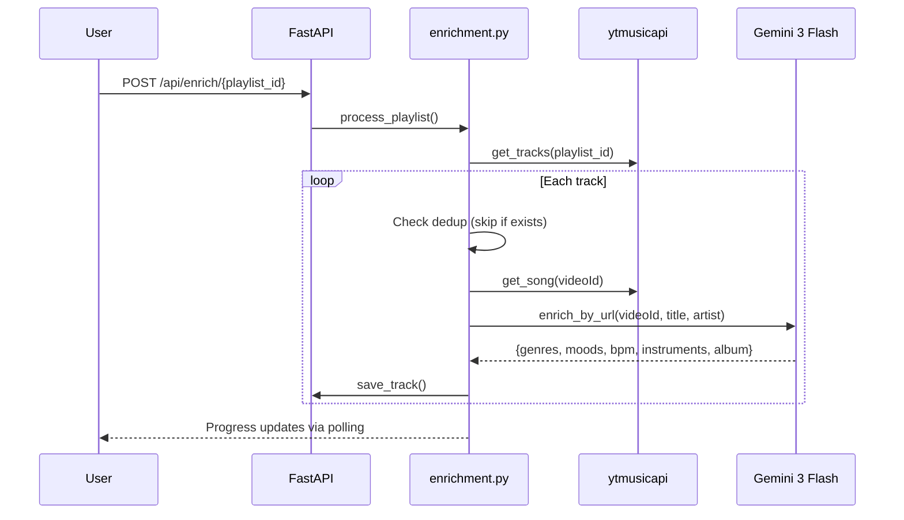

# Architecture

Song Shake uses a **feature-based architecture** with Protocol-based dependency injection for testability.

## Development vs Production

| Aspect | Development | Production |
|--------|------------|------------|
| **Storage** | TinyDB (`songs.db`, `tokens.db`) | Cloud Firestore |
| **Frontend** | Vite dev server (`:5173`) | Firebase Hosting |
| **Backend** | `uvicorn --reload` (`:8000`) | Cloud Run |
| **Auth** | `localhost` callbacks | Firebase domain callbacks |
| **Builder** | — | Cloud Build (via `gcloud run deploy --source`) |

## System Diagram

### Development Mode



### Production Mode



## Component Map

```
src/song_shake/
├── api.py                    # FastAPI app, CORS, root route
├── main.py                   # Typer CLI entry point
├── features/
│   ├── auth/                 # Google OAuth, JWT sessions
│   │   ├── routes.py         # /auth/* endpoints
│   │   └── auth.py           # CLI auth (header paste)
│   ├── enrichment/           # Core enrichment pipeline
│   │   ├── enrichment.py     # process_playlist(), retry_failed_tracks()
│   │   ├── enricher_adapter.py   # GeminiEnricherAdapter (URL-based)
│   │   ├── song_adapter.py   # YTMusicSongAdapter (per-song metadata)
│   │   ├── album_adapter.py  # YTMusicAlbumAdapter
│   │   ├── playlist_adapter.py   # YTMusicPlaylistAdapter
│   │   └── taxonomy.py       # Standardized genre/mood/instrument lists
│   └── songs/                # Storage + API routes
│       ├── routes.py         # /api/* endpoints
│       ├── storage.py        # StoragePort implementation (Firestore/TinyDB)
│       └── routes_*.py       # Grouped route modules
├── platform/
│   ├── protocols.py          # Protocol interfaces (StoragePort, AudioEnricher, etc.)
│   ├── logging_config.py     # Structured logging (structlog)
│   └── storage_factory.py    # Storage backend selection
└── web/                      # Vue.js frontend
```

## Key Protocols

All I/O is abstracted behind Protocol classes for testability:

| Protocol | Production Adapter | Purpose |
|----------|-------------------|---------|
| `StoragePort` | Firestore / TinyDB | Track and history persistence |
| `AudioEnricher` | `GeminiEnricherAdapter` | URL-based AI enrichment |
| `PlaylistFetcher` | `YTMusicPlaylistAdapter` | Playlist track listing |
| `SongFetcher` | `YTMusicSongAdapter` | Per-song metadata + alternatives |
| `AlbumFetcher` | `YTMusicAlbumAdapter` | Album year/details |

## Enrichment Flow


