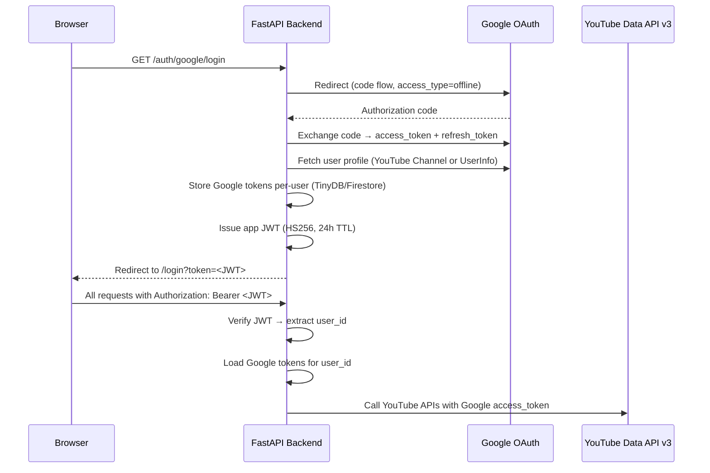
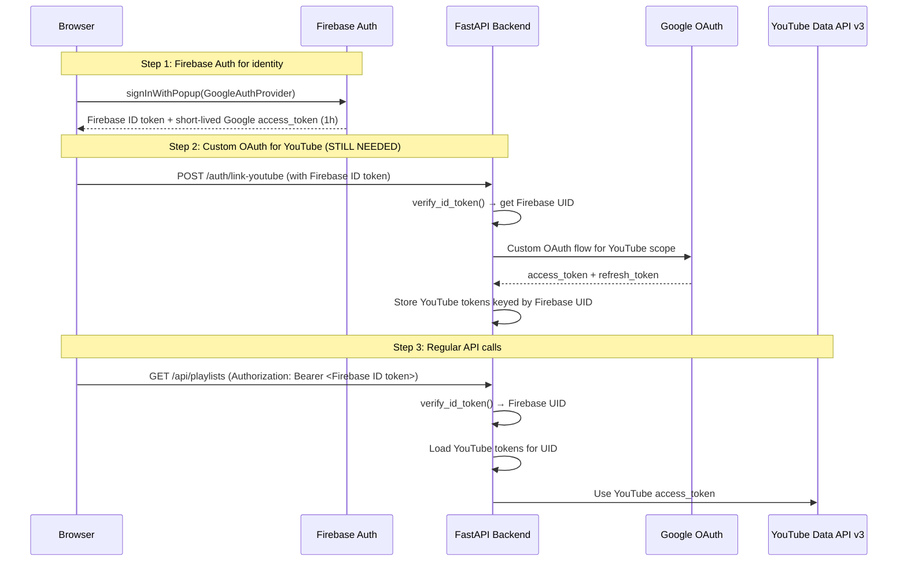

# Research Log: Firebase Auth Evaluation

## Date: 2026-02-24

## Context

SongShake currently uses a **custom Google OAuth 2.0 flow** with a **self-issued JWT session layer**. The question is whether migrating to **Firebase Authentication** would simplify, improve, or harm the current architecture.

---

## Current Auth Architecture (Baseline)

### How It Works Today

### Components Involved

| File | Role |
|------|------|
| `features/auth/routes.py` | OAuth login, callback, /me, /status, /refresh, /logout |
| `features/auth/jwt.py` | HS256 JWT create/decode (24h TTL) |
| `features/auth/dependencies.py` | `get_current_user()` + `get_authenticated_ytmusic()` |
| `features/auth/token_store.py` | TinyDB per-user Google token storage |
| `platform/protocols.py` | `TokenStoragePort` protocol |
| `platform/firestore_adapter.py` | Firestore implementation of `TokenStoragePort` |
| `web/src/api.js` | JWT in localStorage, Axios interceptors, 401 auto-refresh |
| `web/src/features/auth/Login.jsx` | Google sign-in UI, token extraction from URL |
| `web/src/App.jsx` | `PrivateRoute` wrapper, `checkAuth()` |

### Key Design Decisions Already Made
1. **Separation of Google tokens vs app JWT** — Google tokens stored server-side only, app JWT used for session identity
2. **Per-user token storage** with `TokenStoragePort` protocol (TinyDB dev / Firestore prod)
3. **Automatic token refresh** — Axios interceptor retries on 401, backend refreshes Google token
4. **`access_type=offline`** — Backend receives `refresh_token` for long-lived YouTube API access

---

## Firebase Auth: What It Provides

Firebase Authentication is a managed identity service that handles:
- User sign-up/sign-in (Google, Facebook, Apple, email/password, phone, anonymous)
- Firebase ID tokens (JWTs signed by Google, auto-refreshed by client SDKs)
- Token verification via Firebase Admin SDK (server-side)
- User management (disable, delete, custom claims)
- Session management (auto token refresh, revocation)

### What Firebase Auth Does and Does NOT Give You

| Capability | Firebase Auth Provides? | Notes |
|------------|------------------------|-------|
| Google Sign-In UI/flow | ✅ Yes | Pre-built, handles consent screen |
| Firebase ID token (JWT) | ✅ Yes | Auto-refreshed, 1h TTL, verifiable server-side |
| Google OAuth `access_token` | ⚠️ Short-lived only | Available via `getRedirectResult().credential.accessToken`, expires in ~1 hour |
| Google OAuth `refresh_token` | ❌ **NO** | **Firebase client SDK does NOT expose Google refresh tokens** |
| Server-side token verification | ✅ Yes | `firebase_admin.auth.verify_id_token()` |
| Custom claims on tokens | ✅ Yes | e.g., `admin: true`, `role: "premium"` |
| User management | ✅ Yes | List, disable, delete users via Admin SDK |
| Multi-factor auth | ✅ Yes | TOTP, SMS |
| Session cookie management | ✅ Yes | `create_session_cookie()` for server-rendered apps |

---

## Critical Analysis: Firebase Auth for SongShake

### 🚨 SHOWSTOPPER: No Google OAuth Refresh Token

> **Firebase Auth does NOT provide long-lived Google OAuth refresh tokens.**

SongShake's backend **requires** persistent access to YouTube Data API v3 to:
1. Fetch user playlists (`get_data_api_playlists`)
2. Fetch playlist tracks (`get_data_api_tracks`)
3. Build authenticated `YTMusic` clients (`get_authenticated_ytmusic`)
4. Run background enrichment jobs that can take minutes

These operations require a **Google OAuth access token with YouTube scope** (`https://www.googleapis.com/auth/youtube`). Since these tokens expire every hour, the backend needs a **refresh token** to obtain new access tokens without user interaction.

**Firebase Auth only provides:**
- A short-lived Google `access_token` (1 hour) at initial sign-in
- No mechanism to refresh this token server-side
- No `refresh_token` at all

**This means:** Even with Firebase Auth, you would still need the custom server-side OAuth flow to get and store Google refresh tokens for YouTube API access. Firebase Auth would only replace the session/identity layer, not the YouTube API credential management.

---

## Pros of Adopting Firebase Auth

### ✅ P1: Eliminate Custom JWT Management
- **Current:** Custom `jwt.py` with HS256, manual secret management, manual expiry logic
- **Firebase Auth:** ID tokens auto-generated and auto-refreshed by Firebase SDK. Server verifies with `verify_id_token()` — no secret management needed
- **Impact:** Remove `jwt.py` (~100 LOC), simplify `JWT_SECRET` env var management

### ✅ P2: Better Token Security
- **Current:** JWT stored in `localStorage` (vulnerable to XSS)
- **Firebase Auth:** Token managed by Firebase SDK internally, can use `getIdToken()` on demand. Still needs to be sent in headers, but the SDK handles refresh transparently
- **Impact:** Marginal improvement — XSS risk remains unless using HTTP-only cookies (which Firebase doesn't manage for SPAs either)

### ✅ P3: Pre-built Authentication UI (Optional)
- **Firebase Auth:** FirebaseUI provides drop-in sign-in widgets
- **Impact:** Could replace `Login.jsx` with a few lines of code
- **Caveat:** Current Login.jsx is already polished and branded — might not want generic UI

### ✅ P4: Consistent Identity with Firestore
- **Current:** Firestore accessed via Admin SDK (bypasses rules). User identity is a YouTube channel ID
- **Firebase Auth:** Firebase UID would be the canonical user ID. Could enable Firestore Security Rules with `request.auth.uid`
- **Impact:** Could tighten security if client-side Firestore access is ever needed. Currently irrelevant since all access is via Admin SDK

### ✅ P5: Multi-Provider Support (Future)
- **Firebase Auth:** Easy to add Apple, GitHub, email/password sign-in later
- **Impact:** Low value — SongShake specifically requires Google/YouTube OAuth. Other providers can't access YouTube

### ✅ P6: Already Using Firebase
- The project already uses Firebase Hosting, Firestore, and has `firebase.json` configured
- Adding Firebase Auth is a natural extension of the existing Firebase setup

---

## Cons of Adopting Firebase Auth

### ❌ C1: Does NOT Replace the Core OAuth Flow (CRITICAL)
- You still need the custom `routes.py` OAuth flow for YouTube refresh tokens
- Firebase Auth would be **additive complexity**, not a replacement
- You'd have TWO authentication systems running in parallel:
  1. Firebase Auth for identity/session
  2. Custom OAuth for YouTube API credentials
- **Impact:** More complex, more code, more failure modes — the opposite of the goal

### ❌ C2: Dual Token Management
- **Current:** One flow: Google OAuth → app JWT → per-user Google tokens
- **With Firebase Auth:** Two flows:
  1. Firebase Auth for sign-in → Firebase ID token for session
  2. Custom OAuth (still needed) for YouTube refresh tokens
- Frontend would need to manage both Firebase tokens AND potentially custom tokens
- Backend would verify Firebase tokens AND manage Google OAuth tokens separately

### ❌ C3: Library Overhead
- **Current backend deps:** `PyJWT` (~10KB)
- **With Firebase Auth:** `firebase-admin` SDK (already installed for Firestore, but auth module adds complexity)
- **Frontend:** `firebase` JS SDK (~100KB+ for auth module)
- **Impact:** Bundle size increase for frontend, minimal backend impact

### ❌ C4: Migration Complexity
- Existing users have data keyed by YouTube Channel ID (e.g., `UCxxxxxxxxxx`)
- Firebase Auth would introduce Firebase UIDs (e.g., `AbCdEfGh123456`)
- Would need to:
  1. Migrate all Firestore documents from channel ID → Firebase UID
  2. Or maintain a mapping table
  3. Or use `customToken` with existing channel IDs (partial solution)
- **Impact:** Non-trivial data migration, risk of breaking existing user data

### ❌ C5: Loss of Architectural Control
- **Current:** Full control over token lifetime (24h), payload contents, refresh logic
- **Firebase Auth:** ID tokens always 1 hour, must use `getIdToken(true)` to force refresh
- Custom claims limited to 1000 bytes
- **Impact:** Less flexibility, though current needs are simple

### ❌ C6: Vendor Lock-in (Deeper)
- Already locked into Firebase for Hosting + Firestore
- Adding Auth deepens the lock-in — harder to migrate away
- **Impact:** Moderate concern for a personal project, but worth noting

### ❌ C7: SSE/EventSource Complications
- **Current:** JWT passed as query param for SSE (EventSource can't set headers)
- **Firebase Auth:** Same constraint applies — Firebase ID tokens would need to be passed as query params too
- **Impact:** No improvement, same workaround needed

### ❌ C8: Development Workflow
- **Current:** Dev server works with simple `JWT_SECRET` env var, no external dependencies
- **Firebase Auth:** Requires Firebase project connection even in development, or Firebase Auth emulator setup
- **Impact:** Slightly more complex local development

---

## Hybrid Architecture: What It Would Look Like

If Firebase Auth were adopted, the architecture would be:

**Verdict:** This is MORE complex than the current flow, not less.

---

## Cost Analysis

| Aspect | Current (Custom) | Firebase Auth |
|--------|------------------|---------------|
| **Code to maintain** | ~500 LOC (jwt.py, routes.py, dependencies.py) | ~200 LOC (Firebase verify) + ~300 LOC (YouTube OAuth — still needed) |
| **Dependencies** | `PyJWT` (lightweight) | `firebase-admin` (already present) + `firebase` JS SDK (new ~100KB) |
| **Env vars** | `JWT_SECRET`, `GOOGLE_CLIENT_ID/SECRET` | `GOOGLE_CLIENT_ID/SECRET` (still needed for YouTube) |
| **Token systems** | 1 (app JWT + Google tokens) | 2 (Firebase ID token + Google YouTube tokens) |
| **Free tier** | Unlimited (self-managed) | 50k MAU free (generous, unlikely to exceed) |
| **Migration effort** | N/A | High (UID migration, dual auth period, frontend rewrite) |

---

## Decision Matrix

| Factor | Weight | Custom OAuth (Current) | Firebase Auth |
|--------|--------|----------------------|---------------|
| Simplicity | High | ⭐⭐⭐⭐ (one flow) | ⭐⭐ (two flows needed) |
| YouTube API support | Critical | ⭐⭐⭐⭐⭐ (built for this) | ⭐⭐ (still needs custom OAuth) |
| Security | High | ⭐⭐⭐ (HS256, localStorage) | ⭐⭐⭐⭐ (Google-signed tokens) |
| Code reduction | Medium | ⭐⭐⭐ (current size is fine) | ⭐⭐ (adds more code overall) |
| Multi-user support | Medium | ⭐⭐⭐⭐ (already works) | ⭐⭐⭐⭐⭐ (built-in) |
| Ecosystem fit | Low | ⭐⭐⭐ (standalone) | ⭐⭐⭐⭐ (matches Firebase stack) |
| Migration risk | High | ⭐⭐⭐⭐⭐ (nothing to migrate) | ⭐⭐ (UID mapping, data migration) |
| Future extensibility | Low | ⭐⭐⭐ (manual work for new providers) | ⭐⭐⭐⭐⭐ (easy multi-provider) |

---

## Recommendation

> **Keep the current custom OAuth + JWT architecture.**

### Rationale
1. **The fundamental blocker:** Firebase Auth cannot provide Google OAuth refresh tokens, which are essential for SongShake's YouTube API integration. Adopting Firebase Auth would **add a second auth system** rather than replace the existing one.

2. **The current architecture is already well-designed:** The separation of concerns (app JWT for sessions, Google tokens for YouTube API) follows best practices. The `TokenStoragePort` protocol enables clean testing.

3. **The migration cost is high for marginal benefit:** New Firebase UIDs would require data migration across all Firestore collections. The frontend would need significant rework to use the Firebase JS SDK alongside the existing API layer.

4. **Net complexity increase:** Adding Firebase Auth results in maintaining two authentication systems instead of one, which violates KISS and adds failure modes.

### When Firebase Auth WOULD Make Sense
- If SongShake stopped needing server-side YouTube API access (unlikely)
- If the app expanded to support non-Google identity providers as a core feature
- If client-side Firestore access (with Security Rules) became a requirement
- If the user base grew to a scale where managed session infrastructure was needed

### Recommended Improvements to Current Auth (Instead)
If security or robustness is the concern, these improvements to the existing system would be higher value:

1. **Move JWT to HTTP-only cookie** — Eliminates XSS token theft risk
2. **Switch from HS256 to RS256** — Asymmetric signing, public key verification
3. **Add CSRF protection** — If using cookies
4. **Add rate limiting on auth endpoints** — Prevent brute force
5. **Implement token revocation** — Allowlist/denylist for JWTs

---

## Sources

- Firebase Auth documentation: [firebase.google.com/docs/auth](https://firebase.google.com/docs/auth)
- Firebase Admin SDK (Python): [firebase.google.com/docs/admin/setup](https://firebase.google.com/docs/admin/setup)
- Google OAuth 2.0 for server-side apps: [developers.google.com/identity/protocols/oauth2/web-server](https://developers.google.com/identity/protocols/oauth2/web-server)
- Firebase Auth Google provider limitations with refresh tokens: Multiple Stack Overflow threads, GitHub issues
- Firebase Auth pricing: [firebase.google.com/pricing](https://firebase.google.com/pricing)
