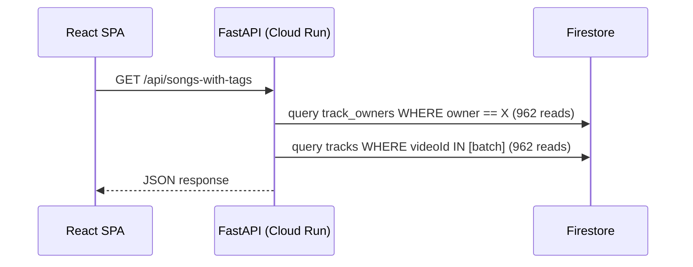

# Research Log: Firestore Realtime Listeners (Client-Side) Evaluation

## Date: 2026-02-24

## Context

SongShake currently uses a **server-side architecture**: the React SPA calls FastAPI backend endpoints, and the backend reads/writes Firestore using the Firebase Admin SDK. Client-side Firestore access is explicitly **denied** in security rules (defense-in-depth).

The question: would switching to **Firestore client-side realtime listeners** (`onSnapshot`) reduce Firestore read costs?

---

## Current Architecture (Baseline)



### Key Numbers

| Metric | Value |
|--------|-------|
| Total tracks | ~962 |
| Reads per `get_all_tracks()` | ~1,924 (962 ownership + 962 track docs) |
| TTL cache | 60s (backend in-memory) |
| Polling | None when idle (fixed in previous optimization) |
| Free tier | 50,000 reads/day |
| Current idle usage | ~10K reads/hour (with cache) |
| Data change frequency | Low — tracks only change during enrichment runs |

### Current Firestore Collections

| Collection | Doc Count | Update Frequency |
|------------|-----------|-----------------|
| `tracks` | ~962 | Only during enrichment (rare) |
| `track_owners` | ~962 | Only during enrichment (rare) |
| `enrichment_history` | ~10 | Per enrichment run |
| `jobs` | ~5-10 | During active jobs only |
| `ai_usage` | 1 | Incremented during enrichment |
| `vibe_playlists` | ~5-10 | When generating AI playlists |

---

## Firestore Realtime Listeners: How Billing Works

### Read Charges with `onSnapshot`

| Event | Reads Charged |
|-------|--------------|
| **Initial listener attach** | 1 read per document in result set |
| **Document added to result** | 1 read |
| **Document updated in result** | 1 read |
| **Document removed from result** (field change) | 1 read |
| **Document deleted** | 0 reads (free) |
| **Reconnection after >30min offline** | Full re-read (treated as new query) |
| **Empty query result** | 1 read minimum |
| **Security rules `get()`/`exists()`** | Extra reads per referenced doc |

### Key Insight

> **After the initial snapshot, you only pay for documents that actually change.** This is fundamentally different from polling, where you pay for ALL documents every time.

---

## Cost Comparison: Current vs Realtime Listeners

### Scenario 1: Idle User Browsing (Most Common)

The user opens the app, browses tracks, filters by tags. No enrichment running.

| Action | Current (Server-Side) | Realtime Listener |
|--------|----------------------|-------------------|
| First page load | ~1,924 reads (backend query) | ~962 reads (listen on `tracks` only*) |
| User navigates to different page, comes back | ~1,924 reads (backend re-query, may hit cache) | 0 reads (listener still active, data unchanged) |
| User sits idle for 5 min | 0 reads (no polling) | 0 reads (listener alive, no changes) |
| User sits idle for 1 hour | 0 reads (no polling) | 0 reads (listener alive, no changes) |
| **Session total (1 hour, idle)** | **~1,924–5,772 reads** | **~962 reads† + changes only** |

*\* With client-side access, you could query `tracks` directly instead of the two-step `track_owners` → `tracks` pattern, using a different data model.*

*† The 962 initial read assumes a restructured data model where ownership is embedded in the track document, eliminating the `track_owners` join.*

### Scenario 2: During Enrichment (Rare)

Backend processes 100 new tracks over 30 minutes.

| Action | Current (Server-Side) | Realtime Listener |
|--------|----------------------|-------------------|
| Viewing job progress | Polling `/api/jobs` every 10s (~3 reads/poll) | Listener on `jobs/{id}` (1 read per update) |
| 100 tracks saved | Not visible until next page load | 100 reads (1 per new track pushed to client) |
| AI usage updates | Polling every 2s when active (~1 read/poll) | Listener on `ai_usage` (1 read per update) |

### Scenario 3: Tab Left Open Overnight (Edge Case)

| Scenario | Current (Server-Side) | Realtime Listener |
|----------|----------------------|-------------------|
| Tab open but inactive (8 hours) | 0 reads (no polling) | 0 reads (listener alive but no changes) |
| Tab resumes after sleep >30 min | Next API call: ~1,924 reads | **Reconnection: ~962 reads (full re-read)** |
| Tab resumes after sleep <30 min | Next API call: ~1,924 reads | 0 reads (listener reconnects, only diffs) |

---

## Pros of Client-Side Realtime Listeners

### ✅ P1: Dramatically Fewer Reads for Stable Data
- Tracks change rarely (only during enrichment)
- After initial listen: 0 reads while browsing, filtering, navigating
- **Potential savings: 50-80% fewer reads per session** vs current approach

### ✅ P2: Automatic Real-Time Updates
- When enrichment adds tracks, the UI updates instantly
- No need for polling `/api/jobs` or manual refresh
- Better UX during enrichment — tracks appear as they're processed

### ✅ P3: Eliminates Backend for Read Operations
- `GET /api/songs`, `GET /api/tags`, `GET /api/songs-with-tags` become unnecessary
- Reduces Cloud Run usage (fewer requests = less CPU time = lower cost)
- Cloud Run can scale to 0 more often

### ✅ P4: Eliminates Backend TTL Cache Complexity
- No more `_tracks_cache` with manual invalidation
- No more `_TRACKS_CACHE_TTL` tuning
- Firestore SDK handles caching natively (offline persistence)

### ✅ P5: Offline Support
- Firebase JS SDK includes offline persistence
- App could work (read-only) without network
- Cached data served from IndexedDB

---

## Cons of Client-Side Realtime Listeners

### ❌ C1: Security Rules Complexity (CRITICAL)

**Current state:** All Firestore access is server-side via Admin SDK (bypasses rules). Rules are `allow read, write: if false;` — maximum security.

**With client-side access:** Must write security rules that:
- Authenticate the user (requires Firebase Auth or custom tokens)
- Enforce per-user data isolation (`track_owners` → only your tracks)
- Prevent unauthorized enumeration of other users' data

**The problem:** SongShake uses **custom JWT auth**, not Firebase Auth. Client-side Firestore requires either:
1. **Firebase Auth tokens** — already evaluated and rejected (see `firebase_auth_evaluation.md`)
2. **Custom Auth tokens** — backend mints Firebase custom tokens from its JWT, client uses them for Firestore access. Adds complexity.

> **This is the biggest blocker.** Without Firebase Auth integration, you need the backend to mint custom Firebase Auth tokens, which partially negates the "eliminate backend for reads" benefit.

### ❌ C2: Data Model Restructuring

Current data model uses a **join pattern**:
```
track_owners/{owner}_{videoId}  → { owner, videoId }
tracks/{videoId}                → { videoId, title, artist, genres, ... }
```

Client-side listeners can't efficiently do this join. You'd need to either:
1. **Denormalize:** Embed `owner` in `tracks` documents → loses multi-owner support
2. **Subcollections:** `users/{uid}/tracks/{videoId}` → requires data migration
3. **Composite queries:** Firestore doesn't support cross-collection joins

**Impact:** Non-trivial schema migration. All existing data (~962 tracks) needs restructuring.

### ❌ C3: Frontend Bundle Size Increase

| Package | Approximate Size (gzipped) |
|---------|---------------------------|
| Current frontend (no Firebase SDK) | ~0 KB Firebase overhead |
| `firebase/app` | ~5 KB |
| `firebase/firestore` (full, with realtime) | ~35-40 KB |
| `firebase/auth` (if using custom tokens) | ~30 KB |
| **Total new overhead** | **~70-75 KB gzipped** |

For a SPA that currently has zero Firebase client-side dependencies, this is a significant addition.

### ❌ C4: Split Read/Write Architecture

**Reads** would go client → Firestore directly.
**Writes** must remain server-side (enrichment, track saving, job management — all require YouTube API access, Gemini API, etc.).

This creates an **asymmetric architecture** where:
- Frontend reads from Firestore directly
- Frontend writes via backend API
- Backend writes to Firestore (which triggers client listeners)

This is a valid pattern, but adds architectural complexity and makes the system harder to reason about.

### ❌ C5: 30-Minute Reconnection Penalty

If a user's tab goes to sleep or loses connectivity for >30 minutes, reconnection costs a full re-read of all matching documents (~962 reads). This is exactly the same cost as the current approach's full fetch, so it's **not worse** — but it's not the savings you might expect for long-idle sessions.

### ❌ C6: Tag Computation Must Move to Client

Currently, tag counts (genre, mood, instrument aggregation) are computed server-side in `get_tags()`. With client-side data, this computation moves to JavaScript in the browser:
- Process 962+ track objects
- Extract and count genres, moods, instruments
- Re-compute on every track change

This is feasible but adds client-side complexity and processing load.

### ❌ C7: Loss of Server-Side Query Flexibility

Current backend can implement complex queries (e.g., BPM range filter + tag filter + pagination) efficiently. With client-side Firestore:
- Composite queries are limited by index requirements
- Complex AND/OR filter combinations need compound indexes
- Pagination with Firestore cursors is more complex client-side

### ❌ C8: Testing and Development Complexity

- Development environment currently uses TinyDB (no Firestore dependency)
- Adding client-side Firestore means frontend needs Firestore emulator in dev
- Integration tests become more complex (client SDK + emulator)
- Mocking Firestore client SDK in React component tests

---

## Quantified Cost Analysis

### Free Tier Budget: 50,000 reads/day

| Usage Pattern | Current (Optimized) | Client-Side Realtime |
|---------------|---------------------|---------------------|
| **1 session/day, 30 min browsing** | ~2,000–6,000 reads | ~962 reads (initial) + ~0 change reads |
| **3 sessions/day** | ~6,000–18,000 reads | ~2,886 reads (3 × initial) |
| **During enrichment (100 tracks)** | ~2,000 + polling overhead | ~962 + 100 change reads |
| **Daily total (typical)** | ~10,000–20,000 reads | ~3,000–5,000 reads |
| **% of free tier** | 20–40% | 6–10% |

**Estimated savings: 60-75% fewer daily reads.**

> However, these savings must be weighed against the implementation cost and architectural complexity.

---

## Viability Assessment

### Technical Viability: ⚠️ MODERATE

| Requirement | Viability | Blocker? |
|------------|-----------|----------|
| Firebase Auth / Custom Tokens | Requires backend to mint custom tokens | Partial blocker |
| Data model migration | Requires schema change + data migration | Moderate effort |
| Security rules | Must be carefully designed and tested | Moderate effort |
| Frontend refactor | Significant — add Firebase SDK, replace API calls with listeners | High effort |
| Backend cleanup | Remove read endpoints, keep write endpoints | Moderate effort |
| Testing | New complexity (emulator, client SDK mocks) | Moderate effort |

### Cost-Benefit Summary

| Factor | Score |
|--------|-------|
| **Read cost reduction** | ⭐⭐⭐⭐⭐ (60-75% savings) |
| **Cloud Run cost reduction** | ⭐⭐⭐⭐ (fewer requests, more scale-to-zero time) |
| **Development time** | ⭐⭐ (high effort: auth, schema, frontend, rules, testing) |
| **Architecture simplicity** | ⭐⭐ (split read/write adds complexity) |
| **UX improvement** | ⭐⭐⭐⭐ (real-time updates during enrichment) |
| **Maintenance burden** | ⭐⭐ (more moving parts: security rules, client SDK, custom tokens) |
| **Risk** | ⭐⭐ (auth integration, data migration, security surface area) |

---

## Recommendation

> **Don't migrate to client-side realtime listeners at this time.**

### Rationale

1. **The savings are real but modest in absolute terms.** Going from ~15,000 reads/day to ~4,000 reads/day is a 73% reduction — but both are well within the 50,000/day free tier. The optimization solves a problem that doesn't currently exist.

2. **The implementation cost is disproportionate.** The work required (custom token minting, data model migration, security rules, frontend refactor, testing overhaul) would take significant effort for a problem that's already been addressed by the server-side TTL cache and polling optimizations.

3. **Auth integration is the critical blocker.** Client-side Firestore requires Firebase Auth or custom tokens. Firebase Auth was already evaluated and rejected (see `firebase_auth_evaluation.md`). Custom token minting adds a new dependency without eliminating the backend.

4. **The split read/write architecture adds complexity** without proportional benefit for a single-user personal project.

### When This WOULD Make Sense

- **If the app scales to 10+ concurrent users** — read costs would multiply linearly, and client-side listeners would amortize better
- **If real-time collaboration becomes a feature** — multiple users viewing/editing shared playlists
- **If Firebase Auth is adopted** — removes the custom token blocker
- **If the 50K reads/day free tier becomes insufficient** — currently using only ~30% of the budget

### Better Alternatives for Cost Optimization (Right Now)

1. **Reduce `track_owners` reads** — explore embedding ownership in `tracks` document (server-side optimization, no architecture change)
2. **Increase TTL cache duration** — from 60s to 5 min for idle sessions (tracks change rarely)
3. **Implement ETag/if-none-match** — skip Firestore reads entirely when data hasn't changed
4. **Firestore Data Bundles** — pre-compute and serve track data via CDN (read-only, no realtime)

---

## Sources

- Firestore pricing: [firebase.google.com/docs/firestore/pricing](https://firebase.google.com/docs/firestore/pricing)
- Firestore realtime listeners billing: [firebase.google.com/docs/firestore/pricing#realtime-updates](https://firebase.google.com/docs/firestore/pricing)
- Firebase client SDK modular imports: [firebase.google.com/docs/web/modular-upgrade](https://firebase.google.com/docs/web/modular-upgrade)
- Firebase Auth evaluation (SongShake): `docs/research_logs/firebase_auth_evaluation.md`
- Firestore read optimization (SongShake): `docs/firestore-read-optimization.md`
- Cost control guide (SongShake): `docs/cost-control.md`
